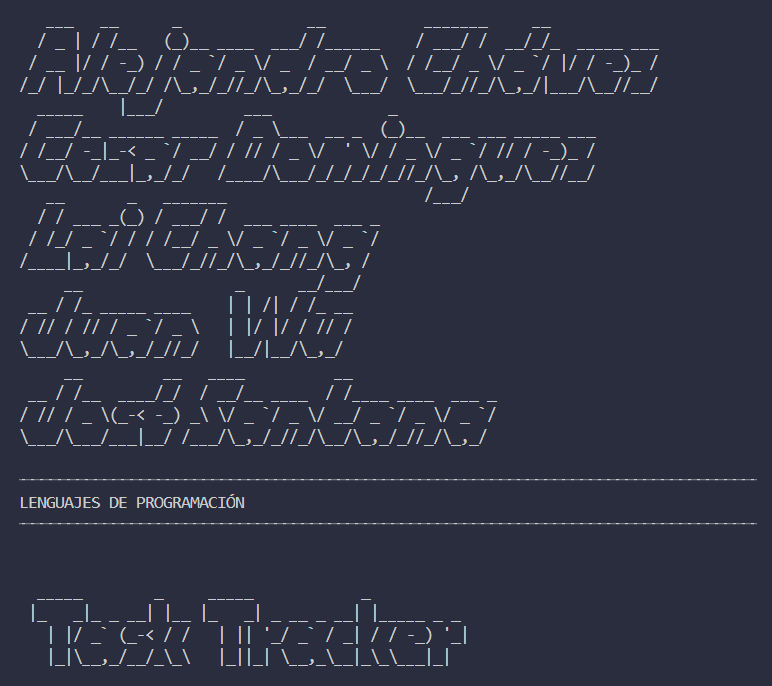

--- 

## Comandos
```bash

python Main.py --help

```

## Instalacion de Dependencias
```python

cat requirements.txt
pip install -r requirements.txt

```

## Activacion de Ambiente
En la carpeta raiz
```python

source bin/activate

```

## Crear comando Personalizado
Ve comando por comando y los ultimos dos ve cual es el que te sirve, depende de tu consola
```bash

chmod +x Main.py
alias task="python Main.py"
source ~/.bashrc
source ~/.zshrc

```
